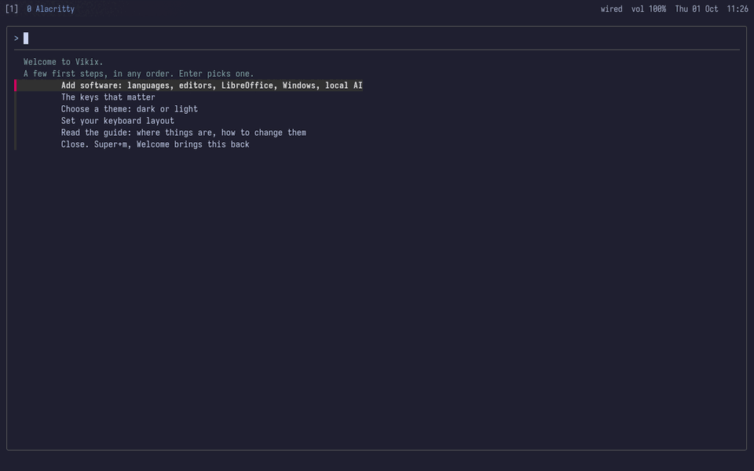

# Your first hour

You've installed Vikix and logged in. This page is the first hour: what you're looking at, the keys worth learning first, adding what you need, making it look yours, and keeping it current. [Installing Void for Vikix](install-void.md) is the page before.

## What you're looking at

At the top is **the bar**: the workspaces on the left, then the windows on this one; on the right the network, the sound, the battery and the time, and before them a word when something needs you (`updates 12`, `backup 9d`). It takes clicks: a workspace's number goes there, a window's title focuses it, `vol` opens the sound mixer, the network opens its settings.

The rest of the screen is windows. There are no title bars and no overlapping: each window fills its part of the screen, and you split the screen to put two side by side. That's StumpWM, and the keys below are how you drive it.



The first time, a terminal opens with **the welcome**. Follow it: it adds software, shows the keys, picks a theme and your keyboard layout, and ticks each step off once it's done. `Super+m` → *Welcome* brings it back.

## The keys that matter

`Super` is the key with the Windows logo. Five to start with:

| Key | What it does |
|---|---|
| `Super+Return` | a terminal |
| `Super+d` (or `Super+Space`) | the launcher: type a program's name, Enter |
| `Super+m` | the Vikix menu: everything, in a list |
| `Super+/` | every key on one card; the next key closes it |
| `Super+q` | close the window |

Then, when you have two windows:

| Key | What it does |
|---|---|
| `Super+b`, `Super+v` | split the screen side by side, or one above the other |
| `Super+h` `j` `k` `l` (or the arrows) | move between them; add `Shift` to move the window |
| `Super+r` | remove a split |
| `Super+f` | fullscreen, and back |
| `Super+Tab` | the last window again |
| `Super+o` | every window on the workspace in a grid; pick one |
| `Super+u` | undo the last layout change |
| `Super+1` … `Super+9` | workspaces; `Super+Shift+1` … sends the window there |

And a few for everyday things: `Super+w` the browser, `Super+e` your files, `Print` a screenshot of an area (to the clipboard, to paste with `Ctrl+v`; `Shift+Print` keeps it as a file in `~/Pictures/Screenshots` instead), `Super+c` the clipboard's history, `Super+Escape` lock, `Super+Shift+Escape` suspend, log out or power off.

**When three windows aren't enough:** a workspace can be a strip instead (Super+m, *This workspace as a strip*, or `vikix viri`). Its windows stand side by side, each half the screen wide, in a row wider than the screen; two show at a time, and `Super+h` / `Super+l` move along the row, scrolling it. The bar shows the whole row, the two on the screen in brackets (`A [B C] D`), and the window you're in has the coloured border, as in tiles. A new window opens beside the one you're in, and nothing shrinks to make room. `Super+Shift+h` / `l` move a window along the row; the same menu entry (or `vikix viri off`) makes it tiles again, split as they were before, each window back in its place (one opened on the strip joins the current split). `Super+r` makes the window's column a third of the screen, two thirds, all of it, then half again (on tiles it still removes a split). `Super+[` and `Super+]` put the window into the column on its left or right, under what's there (an editor with a terminal below it); pressed on a window that shares a column, they take it out into a column of its own. `Super+j` / `Super+k` go up and down a column, and with `Shift` move the window. The bar shows a shared column as `D/C`. `Super+o` on a strip draws the whole strip small, on a card over the screen: each column a box as wide as its share, each window with its number and name and, under them, what it is (a terminal's folder and what runs in it), with a line around the part that's on the screen now. The arrows (or `h` `j` `k` `l`) move a frame from window to window and Enter goes there; a digit goes straight to the window with that number; `/` gives the same windows as a list to type in; Escape, or any other key, closes it. The other window keys work there too: `Super+Tab` goes back to the window you were in, `Super+g` and `Super+Shift+g` find any window or bring it onto the strip, `Super+p` brings the pointer. A strip has no splits and no layout undo, and `Super+b`, `Super+v` and `Super+u` say so. A window sent from a strip to a tiled workspace (`Super+Shift+3`) is tiled there. Each window on a strip has a title bar with its number and name, as tiled windows do (`Super+Ctrl+y` turns them off and on). The mouse works on a strip too: hold `Super` and turn the wheel to walk along it (the wheel on the bar's window names does the same); drag a window's title bar to carry its column along the strip, and let go where it should stand; drag a column's side edge to make it wider or narrower (or, anywhere in it, `Super` and a drag with the right button). In the overview, click a box to go to its window. The strip slides when it scrolls (a tenth of a second or so, with picom running); `(setf *viri-animate* nil)` in `~/.stumpwm.d/user.lisp` makes it jump instead, and `(setf *viri-centre* t)` there keeps the window you're in in the middle of the screen rather than scrolling only as far as it must.

**One main window, the rest beside it:** `Super+Ctrl+m` puts the workspace into main and stack (what dwm and xmonad call master and stack). The window you're in takes the left of the screen, three fifths wide, and the others share a column on its right. It stays so as windows open and close: a new one opens at the top of the stack. `Super+Shift+h` makes the window you're in the main one (with `Shift`, `h` `j` `k` `l` swap it with the window that way), and `Super+r` changes the main window's width: two thirds, a half, three fifths again. The stack shows four windows; any more wait behind the last (`` Super+` `` brings them round). Splits you make by hand are put back at once, until `Super+Ctrl+m` switches the mode off and the layout is yours again. To have a workspace always so, a rule in `~/.stumpwm.d/rules.lisp`: `(when-workspace 2 (command "vikix-main on"))`. For new windows to open as the main one, as in dwm: `(setf *vikix-main-new* :main)` in `user.lisp`.

**Picking a layout:** `Super+Ctrl+Space` is a menu of the ways a workspace can be laid out: tiles you split yourself, main and stack, a grid (every window, tiled again as windows open and close; `Super+Shift+o` switches it too), a strip, and under them the layouts you saved by name (`vikix layout save NAME`). It opens on the one the workspace has now; the arrows or a few letters and Enter pick another, and the windows stay. For a key of your own straight to one: `(vikix-bind "s-C-F1" "vikix-layout-pick main")` in `user.lisp` (`tiles`, `main`, `grid` or `strip`).

**Finding a window:** `Super+g` lists every window on every workspace: its workspace, its title, and what it is (for a terminal, its folder and what's running in it, so five terminals aren't five lines of "Alacritty"). Type a few letters of any of those and Enter goes there; `Super+Shift+g` is the same list, and brings the window to you instead.

`Super+F1` lists every key with what it does, to search and run from there. Mouse focus is on: a window takes your typing when the pointer is over it.

## Add what you need

What came is **the base**: a whole desktop, but no programming languages, editors or office suite. Those are **features**, added when you want them:

```sh
vikix features              # what there is, [x] for what you have
vikix add essentials        # Emacs, and C, Python and Lisp
vikix add python neovim     # any features, by name
vikix add office printing   # LibreOffice, and printers
```

`Super+m` → *Add software* is the same, as a list to tick. A single program that isn't a feature: `vikix pkg add NAME`. `vikix remove NAME` takes a feature away again. [How it fits together](how-it-works.md#the-base-and-the-features) explains the difference.

## Make it look yours

```sh
vikix theme                 # the themes there are
vikix theme nord            # switch: the bar, terminals, menus, lock screen, wallpaper, editors
```

Or `Super+m` → *Theme*. Six come with Vikix: void (the default), paper (light), gruvbox, nord, tokyo-night and contrast (for bright rooms and tired eyes). `vikix theme import` brings one of Omarchy's. The wallpaper follows the theme until you choose your own (`Super+m` → *Wallpaper*).

Your own keys, startup programs and settings go in `~/.stumpwm.d/user.lisp`, which loads last, so it wins: [Making it yours](customize.md) shows how. Before you change a file, `vikix snapshot`; if it goes wrong, `vikix undo`.

## Keep it current

When the bar says `updates`, there's something new:

```sh
vikix update                # Vikix, Void's packages, your languages and tools
vikix update core           # only Vikix: seconds
```

`Super+m` → *Update Vikix* does the first, in a terminal.

## When you're stuck

- **The agent:** `Super+a` starts the AI agent, which knows this desktop: ask it to change a key, find a setting, or explain an error. It takes a snapshot of your files first.
- **The checks:** `vikix doctor` looks at everything Vikix put in place and says what's missing.
- **The guides:** these pages, on your machine too (`Super+m` → *Vikix guide*). [When something breaks](fixing.md) is the one for problems.
