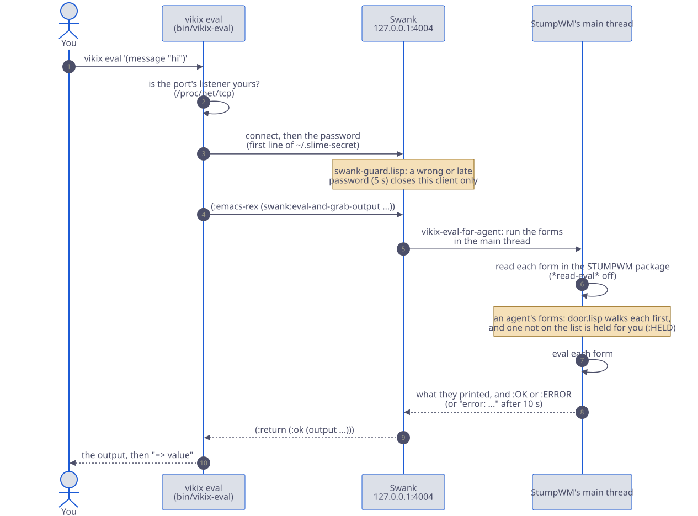

# How it fits together

## The base and the features

`install.sh` (or the one line, `curl -fsSL https://vikix.dev/install | bash`) installs **the base**: StumpWM and the bar, a terminal, Firefox and a file manager, sound, Wi-Fi and Bluetooth, the laptop's hardware, screenshots, themes, backups, and the AI agent. Then you reboot, and the desktop starts.

Everything else is a **feature**, added when you want it:

- **What there is:** `features.list` in the checkout names each feature and the package lists it brings; `bundles.list` groups them (`essentials`, `developer`, `everything`). A package list no feature names is part of the base. `vikix features` shows them all, with the ones you have marked.
- **What you chose:** `~/.config/vikix/features`, one name a line. `vikix add` and `vikix remove` keep it; it's one of your files, so it has an undo too. `./install.sh --with essentials` adds them in the same run as the install.
- **Single programs:** `vikix pkg add NAME` and `vikix pkg drop NAME`, for what isn't a feature. A package Vikix's lists name that you drop goes on `~/.config/vikix/packages-skip`, so updates leave it out.
- **Where they show:** Super+m leaves out entries for features you don't have (JupyterLab, Printers, Windows, local AI …), and the welcome at your first login (`vikix welcome`) has a picker for them.

## From login to desktop

There is no login screen. You log in on the text console, and on tty1 the desktop starts by itself. The other consoles (Ctrl+Alt+F2 …) stay plain text, so if the desktop ever won't start, you can still log in there and fix it.

```
login on tty1
  └─ ~/.bash_profile          the "vikix startx" block: on tty1, with no X yet, exec startx
      └─ ~/.xinitrc           Vikix's: runs vikix-session inside dbus-run-session
          └─ vikix-session    everything that lasts as long as the desktop; its output goes to
              │               ~/.local/state/vikix/session.log
              ├─ INFOPATH, so Emacs and `info` find the Vikix manual
              ├─ .Xresources, the keyboard, screen layout (autorandr), the wallpaper
              ├─ ssh-agent, one for the whole session
              ├─ pipewire, dunst, clipmenud, udiskie (USB drives), picom
              ├─ idle times, night light, the locker (xss-lock → vikix-lock)
              ├─ the Emacs daemon (with the feature emacs), the battery warner, the update checker,
              │  the polkit password box
              ├─ Ollama, for local AI models, once `vikix ai setup` installed it
              └─ ~/.local/bin/stumpwm             the last line; when it exits, the session ends
                  └─ ~/.stumpwm.d/init.lisp
                      ├─ vikix/theme.lisp        colours and fonts
                      ├─ vikix/groups.lisp       workspaces 1–9
                      ├─ vikix/commands.lisp     Vikix's commands and the Super+m menu
                      ├─ vikix/windows.lisp      focus, gaps, layout undo
                      ├─ vikix/keys.lisp         the Super keys
                      ├─ vikix/help.lisp         Super+F1
                      ├─ vikix/webapps.lisp      your web apps: their keys and Super+m entries
                      ├─ vikix/modeline.lisp     the bar
                      ├─ vikix/swank-guard.lisp  a wrong or missing password can't take Swank down
                      ├─ vikix/swank.lisp        Swank on 127.0.0.1:4004 (with a password), for Emacs and `vikix eval`
                      └─ user.lisp               yours, last
```

Each file in that list is loaded on its own. If one has a mistake, StumpWM shows the error on screen and loads the rest, so a typo in `user.lisp` never leaves you without a desktop.

At the very first login, StumpWM also opens the welcome (`vikix welcome`, in a terminal): add software, the keys that matter, a theme, the keyboard layout, the guide. Once it has been shown, it only comes back from `Super+m` → *Welcome*.

**Why no systemd user services:** Void uses runit, which runs system services only. Programs that belong to your desktop session are started by `vikix-session` and end with it. To start one of your own with the desktop, see [startup programs](customize.md#start-a-program-with-the-desktop).

**StumpWM is a running Lisp program.** Its settings aren't read from a config file once; they are Lisp code it runs. So after editing `user.lisp`, tell it to run the files again: `Super+m` → *Reload config*. You can also change it while it runs, without a file: `vikix eval '(message "hi")'` from a terminal, or a REPL from Emacs (`M-x slime-connect`, `127.0.0.1`, `4004`).

### How `vikix eval` reaches StumpWM

For the curious: `vikix eval` is a small Python program that talks to StumpWM the way Emacs does, over Swank. Your code never runs in the Python program; it's sent across and run inside StumpWM itself, in its main thread, so it can touch windows and the bar safely.



Two things keep it safe. The password in `~/.slime-secret` means only you can run code there, and `swank-guard.lisp` makes sure a client with a wrong or slow password is turned away without taking Swank down. And if StumpWM is busy (a menu is open, say), `vikix eval` gives up after 10 seconds with a message, and the code never runs later by surprise.

## What `vikix update` does

1. **Pulls Vikix** into `~/vikix` (`git pull --ff-only`), then starts again from the new version of itself.
2. **Updates Void**: `xbps-install -Su`, xbps itself first.
3. **Runs six install stages again**, each safe to repeat:
   - `10-packages`: installs anything new in the base's lists and your features' lists, leaving out your skip list
   - `20-services`: switches on services new packages brought
   - `40-config`: links Vikix's files again, copies starters you don't have yet, writes the theme files again, makes these guides into the Info manual, and takes a snapshot of your files
   - `45-editors`: for the editors you chose, pulls Emacs's config, and moves Neovim's plugins on when Vikix tested newer ones
   - `65-languages`: for the languages you chose: PicoLisp, Lazarus, Julia
   - `67-dev`: the `~/dev` READMEs, new examples
4. **Runs migrations**: one-off fixes for machines installed before some change, each run once (recorded in `~/.local/state/vikix/migrations/`).
5. **Brings `llm` to its pinned version**, if you have it (`vikix ai llm`).
6. **Reloads StumpWM**, so new keys, the bar and the menu work at once.

A stage that fails doesn't stop the rest; they are named at the end. The whole run is logged in `~/.local/state/vikix/logs/update-<time>.log`.

It asks for your sudo password once. It never asks for anything else, and it never changes your files: only Vikix's links, the files it writes for you, and the marked blocks in `~/.bashrc` and `~/.bash_profile`.

The bar says `updates 12` (Void packages), `Vikix update`, or both, when there is something to bring. `vikix-updates` checks a minute after login and then every 6 hours.

## Whose file is it

This is the rule everything else follows.

- **Vikix's files** are symlinks into `~/vikix`. That's how an update reaches them: the pull changes the file, and every link sees the change. It's also why you shouldn't edit them. The edit would change the checkout, and the next pull would refuse to overwrite it.
- **Your files** start as copies of Vikix's starters. After that they are yours: no update changes them, even when Vikix's starter changes. When a change *must* reach existing copies (a new include line, say), a migration makes exactly that change and nothing else.
- **Marked blocks.** A few shared files, like `~/.bashrc`, have blocks Vikix owns between `# >>> vikix NAME >>>` and `# <<< vikix NAME <<<`. Vikix rewrites the inside of its blocks, and nothing else in the file.
- **Nothing is deleted.** A file that's in the way of one of Vikix's links is moved to `NAME.vikix-bak.<time>`.

The way to change something of Vikix's is to override it from one of your files. The one for the desktop is `user.lisp`, which loads last: bind a key again, set a variable, redefine a command. [Making it yours](customize.md) has examples.

## Themes

A theme is a small file of named colours (`~/vikix/themes/void.theme`). `vikix theme NAME` does three things:

1. saves the name to `~/.config/vikix/theme/current`
2. writes each program's colours into `~/.config/vikix/theme/` (alacritty, kitty, rofi, the lock screen) and `~/.config/dunst/dunstrc.d/10-vikix-theme.conf`
3. repaints StumpWM, reloads dunst, and sets the theme's wallpaper, unless you chose your own

Your own configs *include* those written files. So the theme's colours come in, and anything you set after the include wins. That's how the theme reaches your files without Vikix editing them.

## Snapshots

Your files (listed in `~/vikix/config/yours.list`) have a history in `~/.local/state/vikix/yours.git`. A snapshot is taken after every install and update, before every AI agent session (`Super+a`), and whenever you run `vikix snapshot`. `vikix undo` puts your files back as they were one snapshot ago, and is itself a snapshot, so a second undo reverses it.

It covers your settings, not your documents. For those, `vikix backup`.
