# Installing Void for Vikix

Vikix goes on top of an ordinary Void Linux, so the first step is Void itself. This page walks through its installer once, screen by screen, with the answers Vikix needs; the pictures are from a real install, made for this page. It takes about half an hour, most of it waiting.

**Installing erases the disk you choose.** Copy off anything you want to keep first.

You need:

- a 64-bit PC or laptop (x86_64), with 30 GB of disk or more,
- a USB stick of 2 GB or more, which will be erased too,
- the network: a cable is simplest; Wi-Fi works as well.

## The Void image on a USB stick

Download the live image from [voidlinux.org/download](https://voidlinux.org/download/): **x86_64, glibc, base**, a file named like `void-live-x86_64-20250202-base.iso`. Vikix needs the **glibc** one, not musl. Base is enough, since Vikix brings the desktop; the xfce image works too, but brings a desktop you won't use.

From the same page, take `sha256sum.txt` and check the image, so you know it arrived whole:

```sh
sha256sum -c --ignore-missing sha256sum.txt
```

Write it to the stick. On Linux, find the stick's name with `lsblk` (here `/dev/sdX`; the wrong name erases the wrong disk), then:

```sh
sudo dd if=void-live-x86_64-20250202-base.iso of=/dev/sdX bs=4M status=progress oflag=sync
```

On Windows, Rufus writes it (choose *DD image mode* when it asks); on a Mac, balenaEtcher.

## Start from the stick

Plug the stick in and start the computer with its boot menu key, often F12, F11, F9 or Esc (a ThinkPad: F12), and pick the stick. If it refuses to start it, switch **Secure Boot** off in the firmware settings: Void's image isn't signed for it.

The first entry starts the live system:

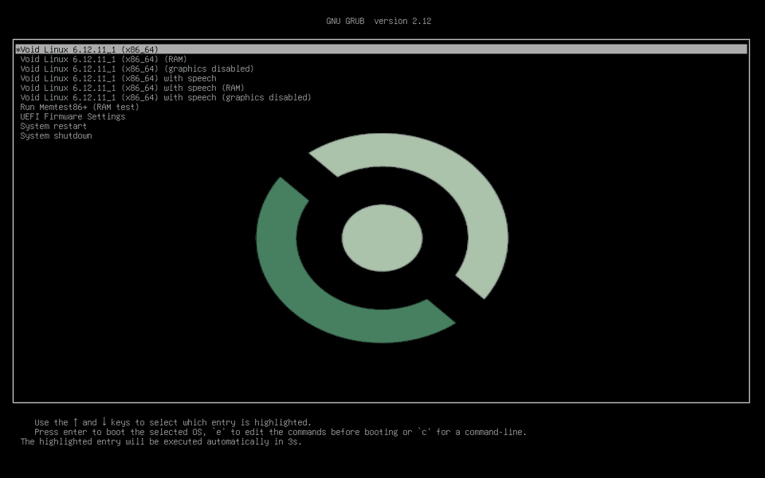

## Start the installer

The live system tells you how to log in. Log in as `root`, password `voidlinux`, and start the installer:

```sh
void-installer
```

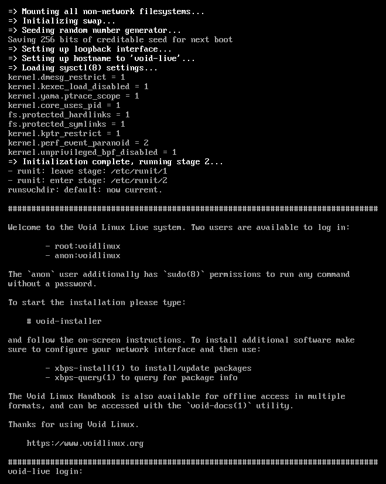

After a welcome, its menu lists every step in order. Go down it from the top; after each step it moves to the next one by itself. Arrows move, Enter chooses, Tab switches between the list and the buttons, Space ticks a box, and typing a letter jumps to the entries that start with it.

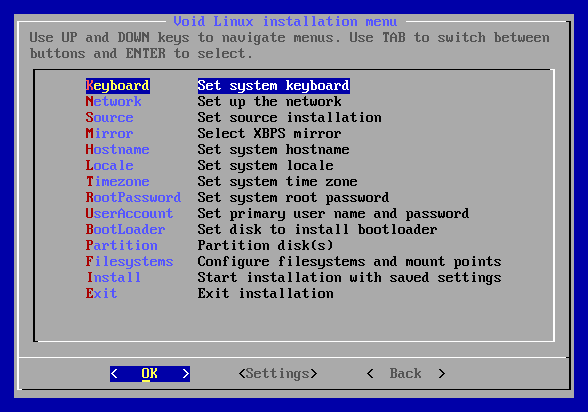

## The menu, step by step

### Keyboard

Your keyboard's layout, for the text screens: `us` for most English keyboards, `uk`, `de`, `fr` and so on. (The desktop's layout is set apart, in Vikix's welcome.)

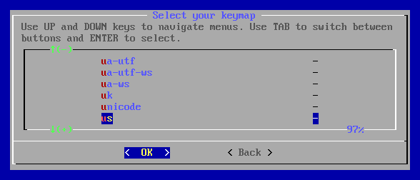

### Network

Choose the network device. A cable is `eth0` or a name like `enp0s31f6`: answer **Yes** to DHCP. Wi-Fi is `wlan0` or `wlp…`: the installer asks for the network's name and password, then the same DHCP question. It says *Network is working properly!* when it is.

### Source

**Network**: the current packages, straight from Void. *Local* installs the ones on the stick, which can be months old; it works too, and Vikix's install updates them anyway, but Network saves that step.

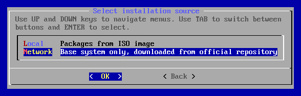

### Mirror

Choose **Default** and confirm. Vikix's install times Void's mirrors itself and uses the fastest, so there's no need to pick one here.

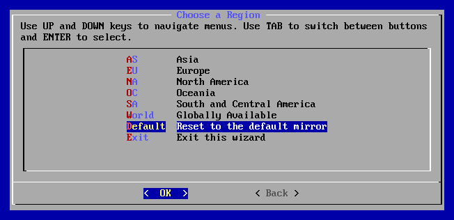

### Hostname, Locale, Timezone

The computer's name (`mylaptop`, anything short), the language and formats (`en_US.UTF-8`; the list is sorted by language name, so English is under E), and your region and city.

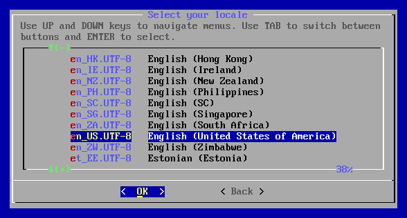

### RootPassword

A password for `root`, twice. You'll rarely use it: day to day, your own password and `sudo` do the work.

### UserAccount

Your login name (short, lowercase: `alex`), the name shown for it (`Alex`), and your password, twice. Then the groups: **keep `wheel` ticked**. It is already, with `audio`, `video` and a few more; `wheel` is what lets you use `sudo`, and Vikix's install needs it. Vikix adds the other groups it needs itself.

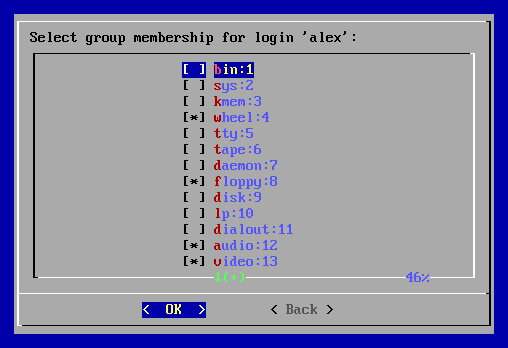

### BootLoader

The disk Void goes on, then **Yes** to a graphical terminal for the boot menu. On a laptop the disk is `/dev/nvme0n1` or `/dev/sda`; in these pictures it's a VM's, `/dev/vda`.

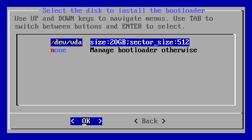

### Partition

Choose the same disk, then **cfdisk**. The installer explains what it needs: on a computer with UEFI, which is nearly every one from the last ten years, two partitions on a **gpt** table. If cfdisk asks for a label type, the disk is empty: choose **gpt**.

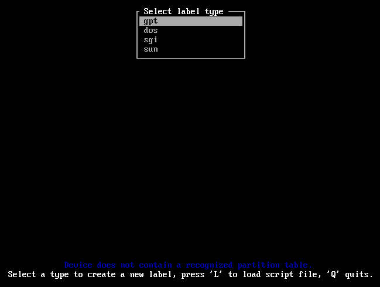

1. Delete the partitions that are there, if any (*Delete* on each): this is the erasing.
2. **New**, size `512M`, then **Type**: *EFI System* (the first in the list).
3. Down to the free space, **New**, and take the size it offers: the rest of the disk, type *Linux filesystem*.
4. **Write**, type `yes`, then **Quit**.

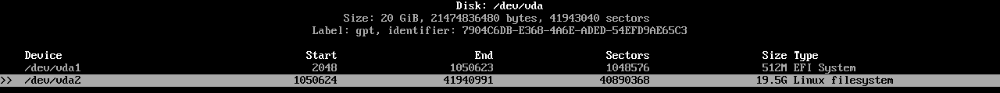

An older PC without UEFI (it has no EFI settings, only "BIOS"): choose *dos* instead, make one partition of type *Linux*, and mark it bootable. The [Void handbook](https://docs.voidlinux.org/installation/live-images/partitions.html) has the details.

### Filesystems

Each partition gets a format and a place:

- the 512M one: **vfat**, mount point `/boot/efi`, and Yes to a new filesystem;
- the big one: **ext4**, mount point `/`, and Yes.

ext4 is the safe choice and what Vikix is tested on. Then **Done**.

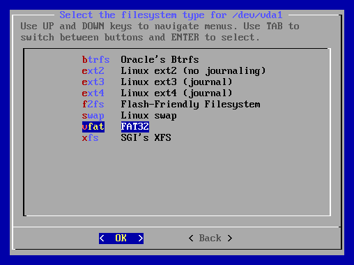

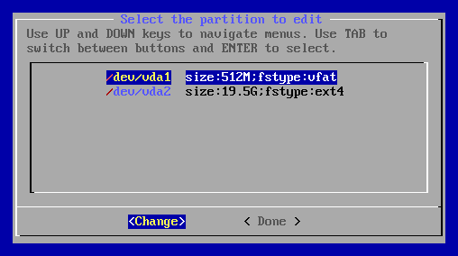

### Install

The installer shows what it will do. **This is the moment the disk is erased**; the earlier steps only noted your answers. Check that it's the disk you mean, then **Yes**.

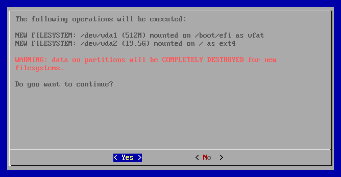

It downloads and installs the base system: a few minutes. Then it asks which services to start at boot. **Leave it as it is**: `dhcpcd`, which is ticked, gives the new system its network at the first start, which Vikix's install needs. (Vikix hands the network to NetworkManager later, and switches `dhcpcd` off itself.)

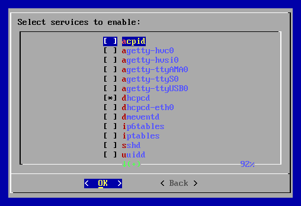

Last: *Void Linux has been installed successfully!* Answer **Yes** to reboot, and take the stick out once the screen goes dark. (Not before: the installer runs from the stick until then.)

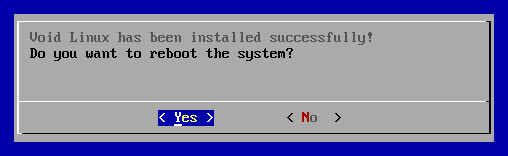

## The first start, then Vikix

The new Void starts on its own disk and asks you to log in. Log in as **yourself**, not root.

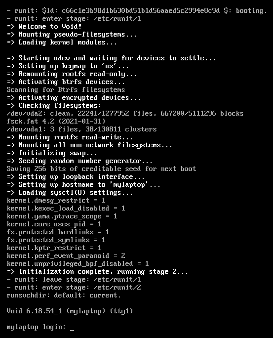

A fresh Void has neither `curl` nor `git`, but it has `xbps-fetch`, which downloads a file. Fetch Vikix's install, read it if you like (it's short), and run it:

```sh
xbps-fetch -o vikix-install https://vikix.dev/install
less vikix-install          # q leaves
bash vikix-install
```

It asks for your password once, installs git, puts Vikix in `~/vikix`, and runs its install. From there it runs by itself, for twenty minutes or more: it downloads the desktop and builds the window manager.

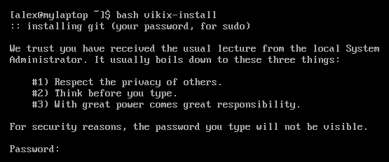

When it says it's done, restart:

```sh
sudo reboot
```

Log in on the first screen again, and the desktop starts. [Your first hour](first-hour.md) is the next page.

If the install stops with an error, the message names the stage that failed; [When something breaks](fixing.md#the-install-stopped) says what to do.
