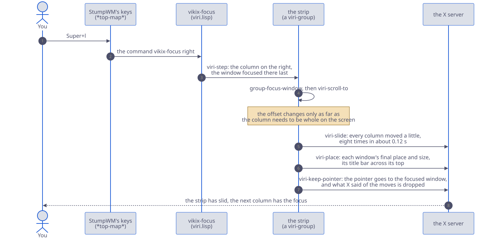

# The strip, a workspace that scrolls

Tiles are good for two or three windows. With five, each is too small to work in, or most are hidden behind others. A strip is the other way to arrange a workspace: its windows stand side by side in a row that is wider than the screen, each as wide as it needs to be, and you move along the row. Nothing shrinks when a window opens, and nothing is hidden: what isn't on the screen is just off to one side.



A column is one window, or a few stacked one above the other. The screen shows as many columns as fit; the rest keep running past its edges, and come back the moment you walk to them.

You choose it for one workspace at a time. The others stay as they are, and the workspace goes back to tiles whenever you like, split as it was before. The idea is Niri's, a Wayland compositor; on Vikix it is called Viri.

## Making a workspace a strip, and tiles again

Any of these, on the workspace you want:

- `Super+m`, then *This workspace as a strip that scrolls sideways (Viri), or tiled again*
- `Super+Ctrl+Space`, the layout menu, then *Strip: columns side by side that scroll sideways*
- `vikix viri` in a terminal (`vikix viri on` and `vikix viri off` say which)

Its windows keep the order they stood in: left to right, then top to bottom. The same again (or `vikix viri off`) makes it tiles, split as they were before it was a strip, each window back in its place. A window opened while it was a strip joins the split you're in.

To have a workspace always start as a strip, a rule in `~/.stumpwm.d/rules.lisp` ([Rules for the desktop](rules.md) is their page):

```lisp
(when-workspace 3 (command "vikix-viri on"))
```

## Moving along it

| Key | What it does |
|---|---|
| `Super+h`, `Super+l` (or the arrows) | the column on the left, on the right; the strip scrolls when it has to |
| `Super+j`, `Super+k` | down and up, in a column of several windows |
| `Super+Home`, `Super+End` | the strip's first column, and its last |
| `Super+Shift+h`, `Super+Shift+l` | move this column left or right along the strip |
| `Super+Shift+j`, `Super+Shift+k` | move this window down or up its column |
| `Super+Tab` | back to the window you were in before; again flips between the two |
| `Super+o` | every workspace drawn small, the strip among them, to pick a window |
| `Super+g` | the list of every window on every workspace, to go to one |

A new window opens as a column of its own, just right of the one you're in, and takes the focus. When you close one, the focus goes to the column that took its place.

The bar at the top shows where you are: the strip's windows in order, the ones on the screen in brackets, the one you're in picked out, as in `A [B C] D`. A column of two windows is written `D/C`. The window you're in has the coloured border and title bar, as on tiles.

The strip scrolls only as far as it must to show the column you went to whole, so a neighbour may show in part. It also keeps a sliver of the next column in sight at each edge of the screen that has one, a couple of dozen pixels: you can tell at a glance that the strip goes on that way. At the strip's ends there's none, and the first and last column stand at the screen's edge. It slides there, in about a tenth of a second.

## Columns: how wide, and what's in them

| Key | What it does |
|---|---|
| `Super+r` | this column wider: half the screen, two thirds, all of it, then a third, and round again |
| `Super+b` | this column exactly as wide as the room the other columns on the screen leave |
| `Super+[`, `Super+]` | this window into the column on its left or right, under what's there; pressed on a window that shares a column, out into a column of its own that way |
| `Super+f` | this window on the whole screen, and back |
| `Super+Ctrl+y` | title bars off and on, as on tiles |

`Super+b` is for when the widths don't add up: a column two thirds wide beside one of a half cuts one of them off. Pressed on a column, it gives that column what the others wholly on the screen leave, so that together they fill it and none is cut. Beside a pinned column it takes the rest of the screen.

A new column is half the screen wide. A column's windows share its height evenly: an editor with a terminal under it, say, is `Super+[` pressed on the terminal standing right of the editor.

### Heights: more for one, less for another

Stacked windows share their column's height evenly to begin with. To give one more: `Super+v` on it makes it a third of the column, then half, then two thirds (the steps above what it has), and after the tallest every window of the column is even again. The others keep their proportions in what's left. With the mouse, drag the edge between two stacked windows up or down: what one gains the other gives, a twentieth of the column at a time.

A window that joins the column takes an even share of it. A layout you save keeps the heights.

### Tabs: one window at a time

Windows stacked in a column each get a part of its height. When they each need all of it (three terminals, two documents), make them tabs instead: `Super+z` on a column of several windows shows one of them as high as the column, with the others behind it. Each is a tab in the title bar, the one showing picked out.

| Key | What it does |
|---|---|
| `Super+z` | this column's windows as tabs; again, stacked one above the other |
| `Super+j`, `Super+k` | the next tab, the one before |
| `Super+Shift+j`, `Super+Shift+k` | move this tab along |
| `Super+[`, `Super+]` | bring the window into the column beside it, as one more tab there; or take a tab out into a column of its own |

A click on a tab goes to it. The bar joins a tabbed column's windows with `+`, as in `A [B D+E+C]`, where a stacked one's are joined with `/`. A layout you save remembers which columns were tabbed. With title bars off (`Super+Ctrl+y`) the tabs still work by the keys; there's just nothing to click.


## Pinning a column

Some windows you want in sight whatever else you're doing: a chat, a page you're reading from, a terminal with a log running. On a strip they'd scroll away with the rest. `Super+\` pins the column you're in: it goes to the screen's left edge and stays there, and the other columns scroll in the room beside it.

| Key | What it does |
|---|---|
| `Super+\` | pin this column; on the pinned column, let it go again |
| `Super+h` from the first of the others | into the pinned column |
| `Super+l` from the pinned column | to the column standing beside it now |

One column is pinned at a time: pin another and it takes the place. The bar shows it first, with a bar after it: `D | A [B C] E`. It keeps its width (`Super+r` and the mouse change it as for any column, though it never takes more than two thirds of the screen), it can hold several windows (`Super+[` from the column beside it), and nothing moves past it. A layout you save remembers which column was pinned. A column too wide for the room the pinned one leaves stands with its left edge at the pinned column and its right part past the screen's edge; `Super+b` on it makes it fit the room exactly.

Two commands have no key of their own, for a key in `user.lisp` if you want one: `vikix-move-end first` and `vikix-move-end last` take the column you're in to the start or the end of the strip.

## The mouse

| Do this | And |
|---|---|
| Hold `Super` and turn the wheel over the strip | you walk along it, as `Super+h` and `Super+l` do |
| Turn the wheel over the bar's window names | the same |
| Sweep two fingers sideways on the touchpad, over the strip | the same: the strip scrolls as a wide page would |
| Drag a window's title bar (or hold `Super` and drag anywhere in it) | its column goes with the pointer, and stays where you let it go |
| Drag a column's side edge (or hold `Super` and drag with the right button) | the column gets wider or narrower, a twentieth of the screen at a time |
| Drag the edge between two windows stacked in a column | the one grows and the other shrinks |
| Click a window's name in the bar | you go to it |

The touchpad's two fingers are the quick way: swept sideways over a strip they walk along it, a column for each short stretch, the way everything else scrolls under them (as yours is set: fingers to the left go to the column on the left, or bring the one on the right where scrolling is "natural"). Up and down they scroll the program, as always, and a little drift sideways while you do walks nowhere. Three fingers do the same on any workspace, and up or down go through a column's windows: `vikix gestures` says how they are set, and `vikix gestures off` stops them ([The commands](commands.md) has the settings). A strip takes sideways scrolling for itself, so a program on one that scrolls sideways (a wide sheet, a long line) is scrolled with its scroll bar, or with `Shift` and the wheel; the setting below gives it back.

A width set by dragging can be any twentieth of the screen; `Super+r` then takes the column to the next of its four widths.

## What's different from tiles

Most keys do on a strip what they do everywhere. A few belong to tiles, and say so when pressed on a strip rather than doing something surprising:

| Key | On a strip |
|---|---|
| `Super+b` | The key for side by side: on a strip it makes this column fill the room the others leave (above). A strip has no splits: a new window gets a column, and `Super+[` and `Super+]` stack. |
| `Super+v` | The key for one above the other: on a strip it makes this window taller in its column (above). |
| `Super+u`, `Super+Shift+u` | No layout undo: a strip keeps its order, and you move a column back. |
| `Super+z` | This column's windows as tabs (above), where on tiles it keeps only one window on the workspace. |
| `Super+Shift+o`, `Super+Ctrl+m` | Grid mode and main and stack are ways of tiling. |
| `Super+Shift+g` | The window you pick comes onto the strip, as a column beside the one you're in. |
| `Super+Shift+1` … `9` | A column is what moves on a strip, so the whole column goes to that workspace: a window alone in its column goes alone; one that shares it takes the others along. On another strip it arrives as the column it was (its width, tabs or stack, the heights); on a tiled workspace its windows are tiled. To send one window of several, take it out of the column first (`Super+[` or `Super+]`). |

Dialogs (a password box, a file chooser) float in the middle of the screen, as on tiles, and aren't columns.

## Settings

In `~/.stumpwm.d/user.lisp`, each a line; `vikix eval '(loadrc)'` applies the file ([Making it yours](customize.md) has more on it):

```lisp
(setf *viri-default-width* 2/3)   ; a new column's width: a part of the screen (1/2 as it comes)
(setf *viri-centre* t)            ; keep the column you're in in the middle of the screen
(setf *viri-peek* 0)              ; no sliver of the next column at the screen's edges (24 pixels as it comes)
(setf *viri-animate* nil)         ; jump instead of sliding
(setf *viri-animate-seconds* 0.2) ; or slide more slowly (0.12 as it comes)
(setf *viri-width-step* 1/10)     ; dragging an edge goes a tenth of the screen at a time
(setf *viri-scroll-clicks* 3)     ; two fingers walk along the strip sooner (6 as it comes; more is slower)
(setf *viri-scroll-walks* nil)    ; two fingers swept sideways scroll the program, not the strip
```

The slide needs a compositor, which Vikix runs (picom). Without one the strip jumps, since each step would make every program draw its window again.

A rule can give a program's window its width or its place as it opens: `(width 2/3)` and `(join :left)`, in [What a rule does](rules.md#what-a-rule-does). A strip's columns, their widths and what's stacked are kept by [saved layouts](customize.md#saved-layouts) too, and a project opened with `vikix project open` comes back as the strip you left.

## When it isn't right

- **A window lies over its neighbours, or a gap stays where one was.** Press `Super+Ctrl+y` twice (title bars off and on again): the strip is laid out afresh. It shouldn't happen, so it's worth a report: `vikix debug` writes one.
- **A program looks stale when you come back to it.** Columns past the screen's edge are moved there, not hidden, so programs keep drawing; one that pauses when it thinks nobody is looking may take a moment to catch up.
- **Two fingers walk too fast, too slowly, or the wrong way.** `*viri-scroll-clicks*` above is how far they go for a step. The way is your touchpad's scrolling direction, the same as in every program; three fingers follow it too, unless `natural` in `~/.config/vikix/gestures` says otherwise.
- **You'd rather have the tiles back.** `vikix viri off`. Nothing is lost: the windows, and the splits the workspace had before.

## For the curious: how a strip works

It is one file, `config/stumpwm/vikix/viri.lisp`, and less than it looks. StumpWM has two kinds of workspace built in: tiled ones, which own the windows' places, and floating ones, which leave each window where it is put. A strip is a floating workspace (`viri-group`, a subclass of StumpWM's `float-group`) in which Viri does the putting. StumpWM's own code still focuses, raises and closes the windows; `viri.lisp` only takes over what a strip does differently: a window joining (`group-add-window`), leaving (`group-delete-window`), being focused (`group-focus-window`), and a press of the mouse (`group-button-press`).

What the strip remembers is small: a list of columns, each with its windows from top to bottom, its width as a part of the screen and the window focused in it last; and how far the strip is scrolled, in pixels from its left end. Everything on the screen follows from those. `viri-place` works out each window's place and size from them, and `viri-layout` calls it whenever something changed.

This is what one press of `Super+l` sets off:



Three things in it are there because of how X and StumpWM work:

- **The keys are not the strip's own.** StumpWM looks in its main key map before any workspace's, and every Vikix key is in the main one. So `Super+l` runs `vikix-focus`, which walks the strip on a strip and moves between splits everywhere else. `vikix-move`, `vikix-split` and the others are made the same way.
- **The slide is a loop, not a timer.** `viri-slide` moves every column a little, eight times, with a short sleep between. A timer would want a fraction of a second as its delay, and StumpWM's timers stop working when given one.
- **The pointer is taken along.** Vikix's focus follows the mouse. When the strip moves under a pointer that stays still, X reports that the pointer has entered whichever window landed under it, and that window would take the focus back. So `viri-keep-pointer` moves the pointer to the focused window and drops those reports.

A window's height in its column is a weight, 1 for an even share, kept by the window (`*viri-weights*`); `viri-heights` turns a column's weights into pixels. Which columns are tabbed is noted the same way (`*viri-tabbed*`): `viri-place` gives each of a tabbed column's windows the whole column and hides all but the one it shows, as a tile's windows behind the one in front are hidden, and the title bar (`vikix-titlebar-draw` in `windows.lisp`) draws a cell for each. The pinned column is the strip's first column in that list, noted in a table beside it (`*viri-pinned*`); `viri-spans` gives it the screen's left edge wherever the strip is scrolled, and starts the others where it ends.

The drawn overview (`Super+o`) is `overview.lisp`; the strip gives it its columns as boxes through `viri-overview-boxes`. An AI agent sees a strip through the `desktop` tool of `vikix mcp`, which lists its columns left to right with their widths and which are on the screen ([Working with AI](ai.md)).

The design, with what was planned and what building it changed, is `DESIGN-viri.md` in the checkout.
